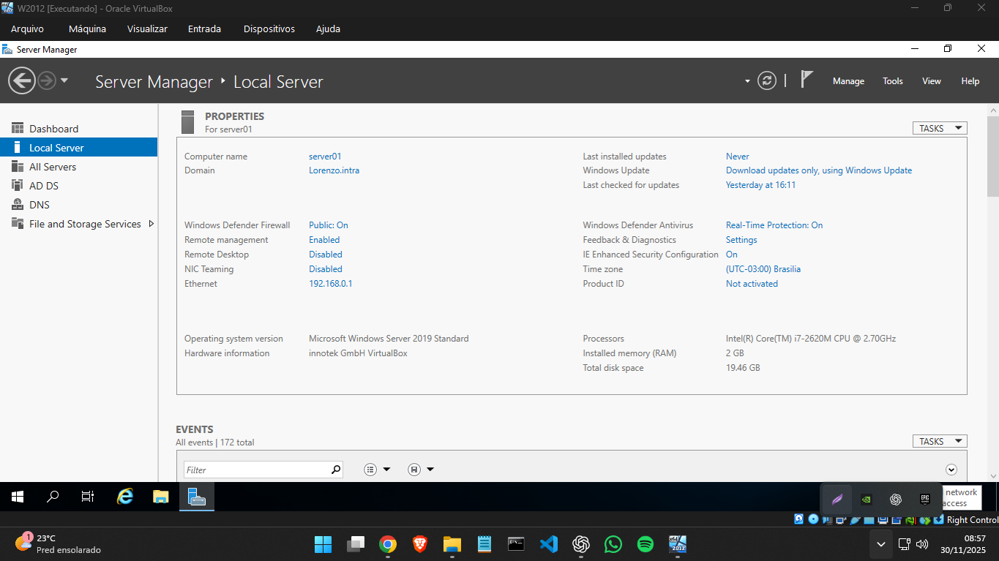

Nome: **Lorenzo Gabriel Almeida Silva**

Disciplina: **Windows Server Management**

Professor: **Anderson Luiz Nogueira Vieira**

## Parte 1:

**1 - Domínio:** Deve ser criado o domínio lorenzo.intra:

**2 - Servidor:** server01

**3 - IP:** 192.168.0.1

## Parte 2:

### Active Directory:

**1 - Criar 2 Unidades Organizacionais:** TI e Financeiro.

**2 - Criar 5 usuários nas OU´s, sendo:**

- TI - 2 usuários, sendo um com meu nome(Lorenzo Almeida).
- Financeiro- 3 usuários.

**3 - Criar 2 computadores na OU Financeiro,** sendo eles COMP01 e COMP02.

**Estrutura de pastas:**

.png)

**Financeiro com 3 usuários e 2 COMP01 e COMP02:**

**TI com 2 usuários:**

## Parte 3:

Usuário “Lais Brum” do Financeiro foi escolhida para só usar a rede durante horário comercial:

**Vitor para ter acesso a comp01 e comp02:**

## Parte 4:

**Deverá criar a pasta Corporativo no drive C: deste servidor e compartilhar a mesma.**

## Parte 5:

**Dentro da pasta compartilhada Corporativo, deverá existir a seguinte estrutura:**

Corporativo
Corporativo\TI
Corporativo\Financeiro
Corporativo\Geral

## Parte 6:

**Você deverá criar 2 Grupos de Segurança, Financeiro e TI e inserir os respectivos usuários nos mesmos.** 

1- Grupo Financeiros, com os respectivos membros:

2- Grupo TI, com seus respectivos membros:

## Parte 7:

**Após criado estes grupos, deverá conceder a permissão necessária para que somente o grupo Financeiro acesse a pasta Financeiro, e somente o grupo TI acesse a pasta TI. Para a pasta geral, todos usuários poderão acessar.**

1- Permissão de Financeiro:

2- Permissão de TI:

3- Permissão de Geral:

